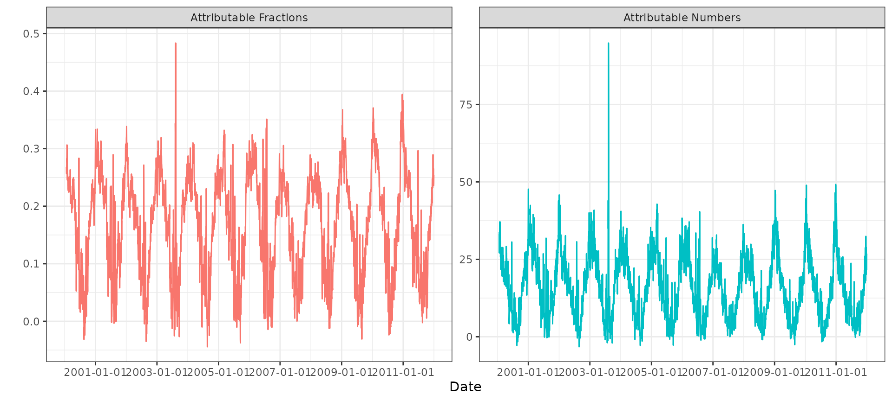
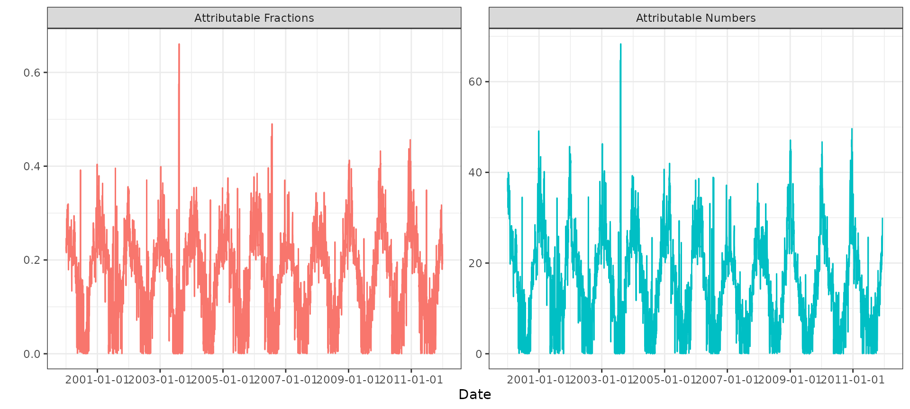
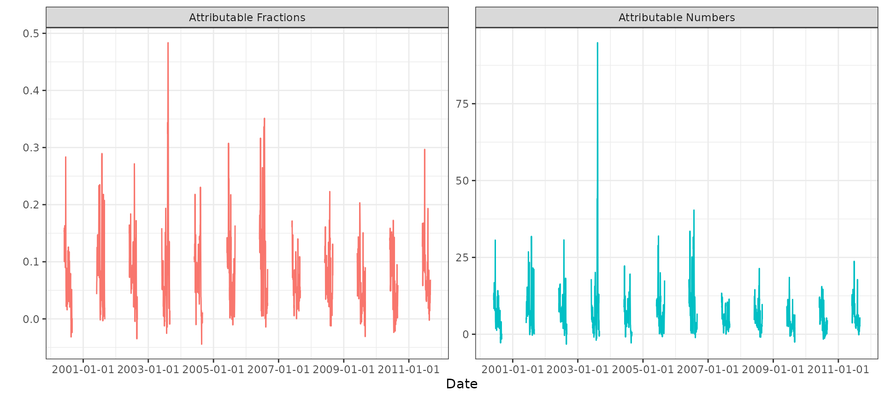

# Attributable measures

``` r
library(bdlnm)
library(dlnm)
#> This is dlnm 2.4.10. For details: help(dlnm) and vignette('dlnmOverview').
library(dplyr)
#> 
#> Attaching package: 'dplyr'
#> The following objects are masked from 'package:stats':
#> 
#>     filter, lag
#> The following objects are masked from 'package:base':
#> 
#>     intersect, setdiff, setequal, union
library(tidyr)
library(stats)
library(splines)
library(utils)
library(ggplot2)
library(lubridate)
#> 
#> Attaching package: 'lubridate'
#> The following objects are masked from 'package:base':
#> 
#>     date, intersect, setdiff, union
```

This article provides a short tutorial on how to calculate attributable
measures using the
[`attributable()`](https://pasahe.github.io/bdlnm/reference/attributable.md)
function. The built-in london dataset is used as an example to estimate
mortality attributable fractions and attributable numbers associated
with temperature among the population aged 75 years or older in London
during the period 2000–2012.

First, we prepare the data, construct the DLNM cross-basis, fit the
Bayesian DLNM model, and estimate the minimum mortality temperature
(MMT) used to center the risks when computing attributable measures.
More detailed information about these steps can be found in the main
vignette.

``` r
# Exposure-response and lag-response spline parameters
dlnm_var <- list(
  var_prc = c(10, 75, 90),
  var_fun = "ns",
  lag_fun = "ns",
  max_lag = 21,
  lagnk = 3
)

# Cross-basis parameters
argvar <- list(fun = dlnm_var$var_fun,
               knots = quantile(london$tmean,
                                dlnm_var$var_prc/100, na.rm = TRUE),
               Bound = range(london$tmean, na.rm = TRUE))

arglag <- list(fun = dlnm_var$lag_fun,
               knots = logknots(dlnm_var$max_lag, nk = dlnm_var$lagnk))

# Create crossbasis
cb <- crossbasis(london$tmean, lag = dlnm_var$max_lag, argvar, arglag)

# Seasonality of mortality time series
seas <- ns(london$date, df = round(8 * length(london$date) / 365.25))

# Prediction values (equidistant points)
temp <- round(seq(min(london$tmean), max(london$tmean), by = 0.1), 1)

# Model

mod <- bdlnm(mort_75plus ~ cb + factor(dow) + seas,
           data = london,
           family = "poisson",
           sample.arg = list(seed = 432))

# compute MMT centering value using optimal_exposure
mmt <- optimal_exposure(mod, exp_at = temp)
#> Registered S3 methods overwritten by 'crs':
#>   method         from
#>   print.crs      sf  
#>   predict.gsl.bs np
cen <- mmt$summary[["0.5quant"]]
cen
#> [1] 18.9
```

The MMT used to center the relative risks is 18.9ºC.

With all set, we can calculate attributable numbers and fractions.
Gasparrini and Leone (2014) describe the methodology in detail:
[Attributable risk from distributed lag
models](https://doi.org/10.1186/1471-2288-14-55).

We can compute attributable fractions and attributable numbers using the
backward algorithm, which quantifies the current burden attributable to
the set of exposure events experienced in the past:

``` r
attr_back <- attributable(mod, london, name_date = "date", name_exposure = "tmean", name_cases = "mort_75plus", cen = cen, dir = "back")
```

The output is a list containing posterior samples of attributable
fractions and attributable numbers computed per day and for the full
study period, together with summaries across posterior samples:

``` r
str(attr_back)
#> List of 8
#>  $ af             : num [1:4383, 1:1000] NA NA NA NA NA NA NA NA NA NA ...
#>   ..- attr(*, "dimnames")=List of 2
#>   .. ..$ : chr [1:4383] "2000-01-01" "2000-01-02" "2000-01-03" "2000-01-04" ...
#>   .. ..$ : chr [1:1000] "sample1" "sample2" "sample3" "sample4" ...
#>  $ an             : num [1:4383, 1:1000] NA NA NA NA NA NA NA NA NA NA ...
#>   ..- attr(*, "dimnames")=List of 2
#>   .. ..$ : chr [1:4383] "2000-01-01" "2000-01-02" "2000-01-03" "2000-01-04" ...
#>   .. ..$ : chr [1:1000] "sample1" "sample2" "sample3" "sample4" ...
#>  $ aftotal        : Named num [1:1000] 0.181 0.187 0.2 0.185 0.147 ...
#>   ..- attr(*, "names")= chr [1:1000] "sample1" "sample2" "sample3" "sample4" ...
#>  $ antotal        : Named num [1:1000] 71799 74286 79188 73419 58128 ...
#>   ..- attr(*, "names")= chr [1:1000] "sample1" "sample2" "sample3" "sample4" ...
#>  $ af.summary     : num [1:4383, 1:6] NA NA NA NA NA NA NA NA NA NA ...
#>   ..- attr(*, "dimnames")=List of 2
#>   .. ..$ : chr [1:4383] "2000-01-01" "2000-01-02" "2000-01-03" "2000-01-04" ...
#>   .. ..$ : chr [1:6] "mean" "sd" "0.025quant" "0.5quant" ...
#>  $ an.summary     : num [1:4383, 1:6] NA NA NA NA NA NA NA NA NA NA ...
#>   ..- attr(*, "dimnames")=List of 2
#>   .. ..$ : chr [1:4383] "2000-01-01" "2000-01-02" "2000-01-03" "2000-01-04" ...
#>   .. ..$ : chr [1:6] "mean" "sd" "0.025quant" "0.5quant" ...
#>  $ aftotal.summary: Named num [1:6] 0.1756 0.0172 0.141 0.1762 0.2105 ...
#>   ..- attr(*, "names")= chr [1:6] "mean" "sd" "0.025quant" "0.5quant" ...
#>  $ antotal.summary: Named num [1:6] 69577 6825 55886 69832 83406 ...
#>   ..- attr(*, "names")= chr [1:6] "mean" "sd" "0.025quant" "0.5quant" ...
```

Using `ggplot2` we can visualize the time series of daily attributable
fractions and attributable numbers:

``` r
london |> 
  mutate(
    "Attributable Fractions" = attr_back$af.summary[,"0.5quant"],
    "Attributable Numbers" = attr_back$an.summary[,"0.5quant"]
  ) |> 
  pivot_longer(c("Attributable Fractions", "Attributable Numbers"), names_to = "name", values_to = "val") |> 
  ggplot(aes(x = date, y = val, color = name)) +
  facet_wrap(~name, scales = "free_y") +
  geom_line() +
  scale_x_date(date_breaks = "2 years") +
  labs(x = "Date", y = "") +
  guides(color = "none") +
  theme_bw()
#> Warning: Removed 42 rows containing missing values or values outside the scale range
#> (`geom_line()`).
```



The total attributable fraction and attributable number over the full
period are:

``` r
options(scipen=999)

rbind(
  "Attributable fraction" = attr_back$aftotal.summary,
  "Attributable number" = attr_back$antotal.summary
) |> 
  knitr::kable(digits = 2)
```

|                       |     mean |      sd | 0.025quant | 0.5quant | 0.975quant |     mode |
|:----------------------|---------:|--------:|-----------:|---------:|-----------:|---------:|
| Attributable fraction |     0.18 |    0.02 |       0.14 |     0.18 |       0.21 |     0.18 |
| Attributable number   | 69576.99 | 6825.41 |   55886.47 | 69831.84 |   83406.12 | 71036.15 |

Alternatively, we can use the forward algorithm, which quantifies the
future burden attributable to a given exposure event:

``` r
attr_forw <- attributable(mod, london, name_date = "date", name_exposure = "tmean", name_cases = "mort_75plus", cen = cen, dir = "forw")
```

We can plot the time series of daily attributable fractions and
attributable numbers based on the forward algorithm:

``` r
london |> 
  mutate(
    "Attributable Fractions" = attr_forw$af.summary[,"0.5quant"],
    "Attributable Numbers" = attr_forw$an.summary[,"0.5quant"]
  ) |> 
  pivot_longer(c("Attributable Fractions", "Attributable Numbers"), names_to = "name", values_to = "val") |> 
  ggplot(aes(x = date, y = val, color = name)) +
  facet_wrap(~name, scales = "free_y") +
  geom_line() +
  scale_x_date(date_breaks = "2 years") +
  labs(x = "Date", y = "") +
  guides(color = "none") +
  theme_bw()
#> Warning: Removed 21 rows containing missing values or values outside the scale range
#> (`geom_line()`).
```



The total attributable fraction and attributable number over the full
period (forward algorithm) are:

``` r
rbind(
  "Attributable fraction" = attr_forw$aftotal.summary,
  "Attributable number" = attr_forw$antotal.summary
) |> 
  knitr::kable(digits = 2)
```

|                       |     mean |      sd | 0.025quant | 0.5quant | 0.975quant |     mode |
|:----------------------|---------:|--------:|-----------:|---------:|-----------:|---------:|
| Attributable fraction |     0.17 |    0.02 |       0.14 |     0.17 |       0.21 |     0.18 |
| Attributable number   | 68669.46 | 6769.00 |   55119.80 | 68933.85 |   82474.45 | 70152.26 |

Finally, we can restrict the calculation to specific time periods using
a filter variable. For example, we can compute attributable measures
only for summer months:

``` r
slondon <- london |> 
  mutate(
    summer = case_when(
      month(date) >= 6 & month(date) <= 8 ~ 1,
      .default = 0
    )
  )

attr_summer <- attributable(mod, slondon, name_date = "date", name_exposure = "tmean", name_cases = "mort_75plus", name_filter = "summer", cen = cen, dir = "back")
#> Warning: Attributable fractions and numbers will only be calculated for time points
#> filtered by "summer"
```

We can plot the time series of daily attributable fractions and
attributable numbers for summers only:

``` r
slondon |> 
  filter(summer == 1) |> 
  mutate(
    "Attributable Fractions" = attr_summer$af.summary[,"0.5quant"],
    "Attributable Numbers" = attr_summer$an.summary[,"0.5quant"]
  ) |> 
  pivot_longer(c("Attributable Fractions", "Attributable Numbers"), names_to = "name", values_to = "val") |> 
  ggplot(aes(x = date, y = val, color = name, group = year)) +
  facet_wrap(~name, scales = "free_y") +
  geom_line() +
  scale_x_date(date_breaks = "2 years") +
  labs(x = "Date", y = "") +
  guides(color = "none") +
  theme_bw()
```



The total attributable fraction and number, only for summers, are:

``` r
rbind(
  "Attributable fraction" = attr_summer$aftotal.summary,
  "Attributable number" = attr_summer$antotal.summary
) |> 
  knitr::kable(digits = 2)
```

|                       |     mean |      sd | 0.025quant | 0.5quant | 0.975quant |     mode |
|:----------------------|---------:|--------:|-----------:|---------:|-----------:|---------:|
| Attributable fraction |     0.09 |    0.01 |       0.06 |     0.09 |       0.11 |     0.09 |
| Attributable number   | 33745.84 | 3852.23 |   25754.77 | 33721.27 |   41702.27 | 33704.74 |
