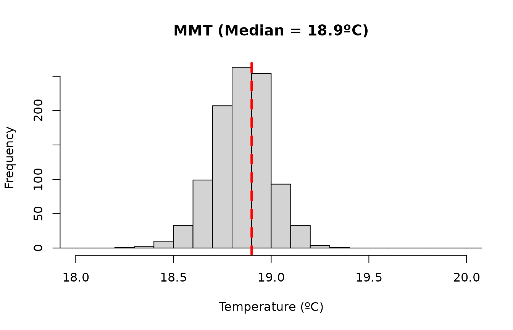
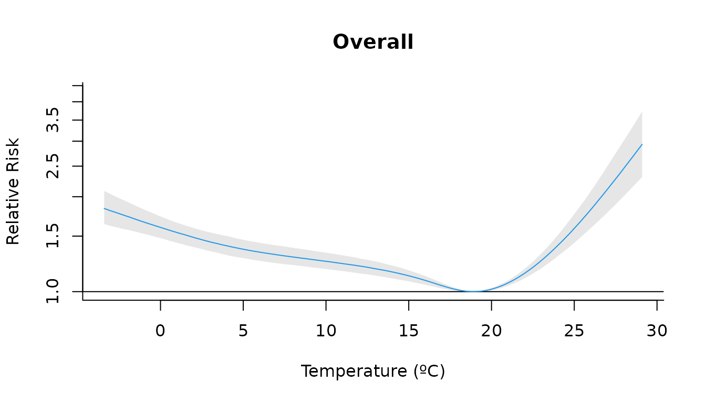
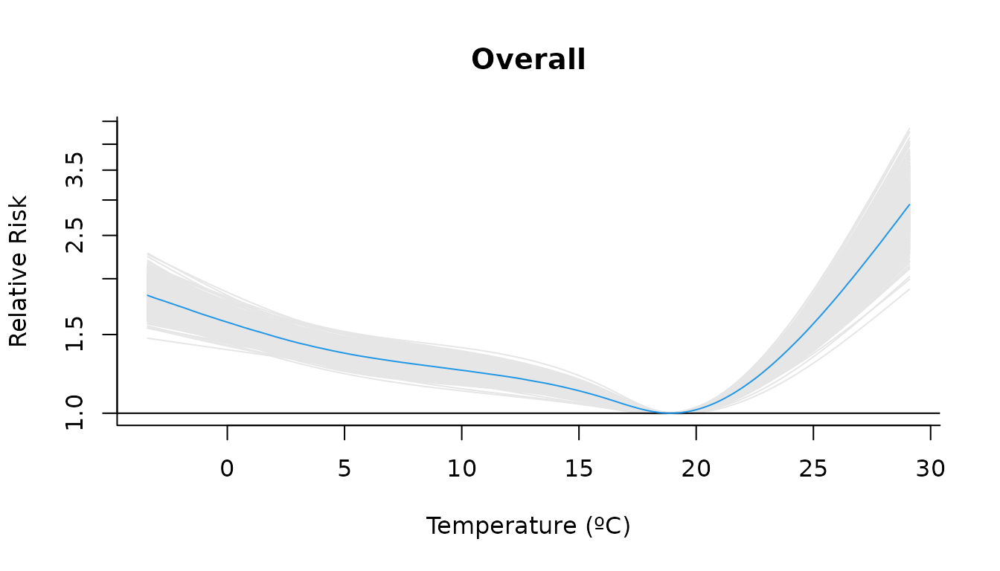
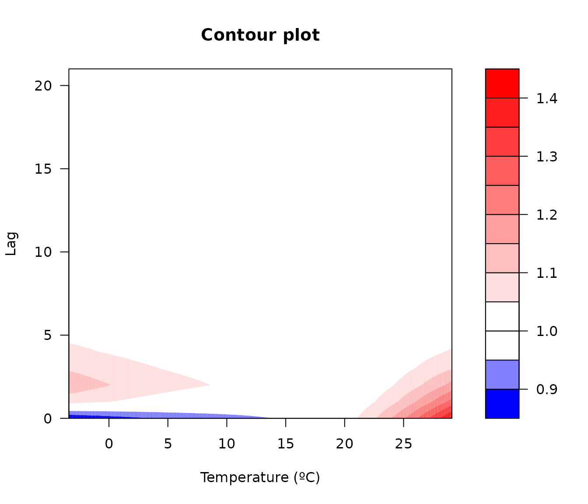
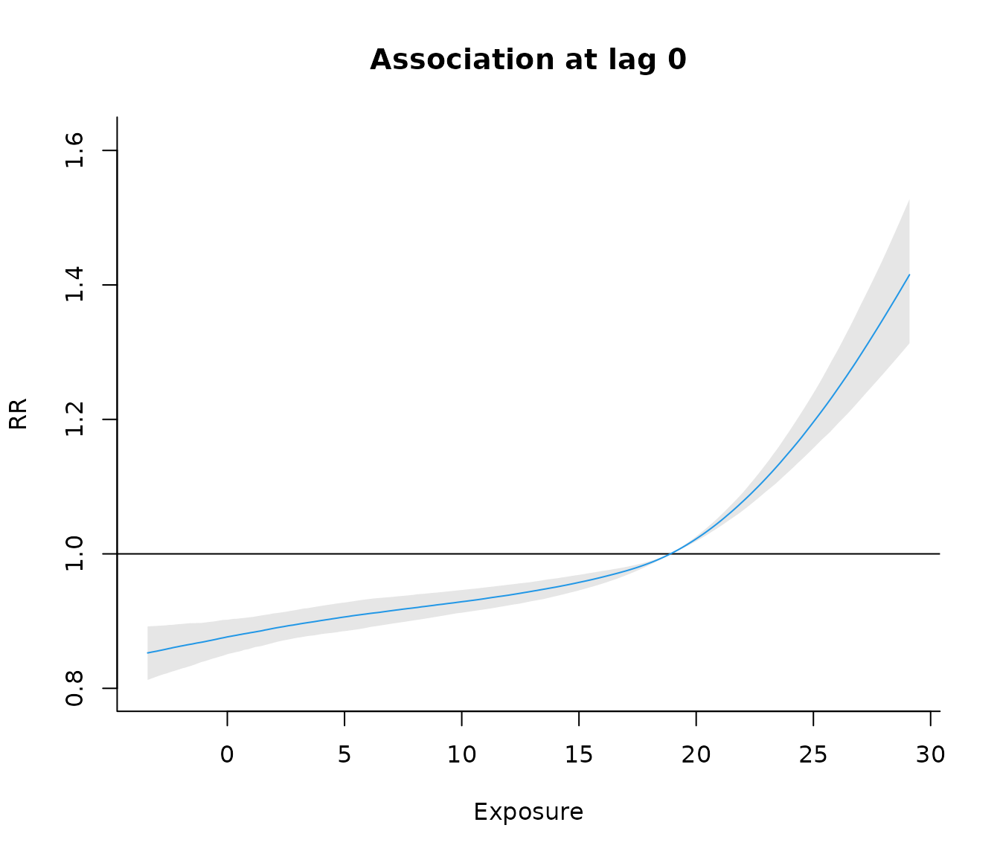

# bdlnm

``` r
library(bdlnm)
library(dlnm)
library(splines)
library(utils)
```

## london dataset

As an example for this vignette, we will use the built-in dataset
`london` which contains daily temperature and mortality data from 2000
to 2012.

``` r
head(london)
#>         date year dow    tmean mort_00_74 mort_75plus mort
#> 1 2000-01-01 2000 Sat 7.642016        101         226  327
#> 2 2000-01-02 2000 Sun 8.351041        100         191  291
#> 3 2000-01-03 2000 Mon 8.188446        107         205  312
#> 4 2000-01-04 2000 Tue 6.320066         97         191  288
#> 5 2000-01-05 2000 Wed 6.550981         92         213  305
#> 6 2000-01-06 2000 Thu 8.728774         82         213  295
```

Using Bayesian Distributed Non-Linear Models (B-DLNM) we will estimate
the lagged effect of the temperature exposure to mortality in the
population with more than 75 years old, taking 21 days of lags, in the
city of London (2000-2012).

## Set DLNM parameters

We will start by building the crossbasis with the `dlnm` package.

We will use a natural spline with three knots for the exposure–response
function, placed at the 10th, 75th, and 90th percentiles of daily mean
temperature, and a natural spline for the lag–response function, with
knots equally spaced on the log scale up to a maximum lag of 21 days:

``` r
# Exposure-response and lag-response spline parameters
dlnm_var <- list(
  var_prc = c(10, 75, 90),
  var_fun = "ns",
  lag_fun = "ns",
  max_lag = 21,
  lagnk = 3
)


# Cross-basis parameters
argvar <- list(
  fun = dlnm_var$var_fun,
  knots = quantile(london$tmean, dlnm_var$var_prc / 100, na.rm = TRUE),
  Bound = range(london$tmean, na.rm = TRUE)
)

arglag <- list(
  fun = dlnm_var$lag_fun,
  knots = logknots(dlnm_var$max_lag, nk = dlnm_var$lagnk)
)

# Create crossbasis
cb <- crossbasis(london$tmean, lag = dlnm_var$max_lag, argvar, arglag)
```

Let’s define the seasonality of the mortality time series using a
natural spline with 8 degrees of freedom per year, which flexibly
controls for long-term and seasonal trends in mortality:

``` r
# Seasonality of mortality time series
seas <- ns(london$date, df = round(8 * length(london$date) / 365.25))
```

Finally, we also define the temperature values for which predictions
will be generated. These correspond to an evenly spaced grid with a
0.1ºC step covering the full range of observed temperatures in the data:

``` r
# Prediction values (equidistant points)
temp <- round(seq(min(london$tmean), max(london$tmean), by = 0.1), 1)
# Ensure it falls inside the range of temperatures after rounding:
temp <- temp[temp >= min(london$tmean) & temp <= max(london$tmean)]
```

## Fit the model and posterior samples

Fit the Bayesian DLNM using the function
[`bdlnm()`](https://pasahe.github.io/bdlnm/reference/bdlnm.md). In this
example, we specify a Poisson model including the cross-basis term, a
seasonal component, and an indicator for the day of the week. We draw
1000 samples from the posterior distribution and set a seed for
reproducibility.

``` r
mod <- bdlnm(
  mort_75plus ~ cb + factor(dow) + seas,
  data = london,
  family = "poisson",
  sample.arg = list(n = 1000, seed = 5243)
)
#> Warning in inla.posterior.sample(n, rfake, intern = intern, use.improved.mean =
#> use.improved.mean, : Since 'seed!=0', parallel model is disabled and serial
#> model is selected, num.threads='1:1'
```

The returned object is of class bdlnm and contains the fitted INLA
model, the crossbasis objects included in the formula, and posterior
samples of the estimated coefficients together with their summaries
(mean, standard deviation, and quantiles).

``` r
str(mod, max.level = 1)
#> List of 4
#>  $ model               :List of 49
#>   ..- attr(*, "class")= chr "inla"
#>  $ basis               :List of 1
#>  $ coefficients        : num [1:123, 1:1000] 5.3638 -0.1381 -0.0152 -0.0464 0.0602 ...
#>   ..- attr(*, "dimnames")=List of 2
#>  $ coefficients.summary: num [1:123, 1:6] 5.2105 -0.1345 -0.0064 -0.0497 0.05 ...
#>   ..- attr(*, "dimnames")=List of 2
#>  - attr(*, "n_sim")= num 1000
#>  - attr(*, "class")= chr "bdlnm"
```

## Minimum mortality temperature

We estimate the minimum mortality temperature (MMT), defined as the
temperature at which the overall mortality risk is minimized. This
optimal value will later be used to center the estimated relative risks.

``` r
mmt <- optimal_exposure(mod, exp_at = temp)
#> Registered S3 method overwritten by 'crs':
#>   method    from
#>   print.crs sf

str(mmt)
#> List of 2
#>  $ est    : Named num [1:1000] 19 18.8 18.8 18.8 19.2 18.8 18.9 19.1 18.9 19 ...
#>   ..- attr(*, "names")= chr [1:1000] "sample1" "sample2" "sample3" "sample4" ...
#>  $ summary: Named num [1:6] 18.9 0.147 18.6 18.9 19.2 ...
#>   ..- attr(*, "names")= chr [1:6] "mean" "sd" "0.025quant" "0.5quant" ...
#>  - attr(*, "exp_at")= num [1:326] -3.4 -3.3 -3.2 -3.1 -3 -2.9 -2.8 -2.7 -2.6 -2.5 ...
#>  - attr(*, "lag_at")= num [1:22] 0 1 2 3 4 5 6 7 8 9 ...
#>  - attr(*, "which")= chr "min"
#>  - attr(*, "class")= chr "optimal_exposure"
```

We can visualize the posterior distribution of the MMT estimates. It is
useful to inspect this distribution to assess whether multiple candidate
optimal exposure values exist and to verify that the median provides a
reasonable centering value:

``` r
plot(
  mmt,
  xlab = "Temperature (ºC)",
  main = paste0("MMT (Median = ", round(mmt$summary[["0.5quant"]], 1), "ºC)")
)
```



To make the predictions, we will center the risk at the median of these
values:

``` r
cen <- mmt$summary[["0.5quant"]]
cen
#> [1] 18.9
```

## Predict exposure-lag-response effects

Predict the exposure–lag–response association between temperature and
mortality from the fitted model at the supplied temperature grid,
centering the predictions at the MMT value:

``` r
cpred <- bcrosspred(mod, exp_at = temp, cen = cen)
```

A `bcrosspred` object is returned containing posterior samples of the
estimated exposure–lag–response association for the supplied temperature
values and lags, together with their summaries.

``` r
str(cpred)
#> List of 16
#>  $ exp_at              : num [1:326] -3.4 -3.3 -3.2 -3.1 -3 -2.9 -2.8 -2.7 -2.6 -2.5 ...
#>  $ lag_at              : num [1:22] 0 1 2 3 4 5 6 7 8 9 ...
#>  $ cen                 : num 18.9
#>  $ coefficients        : num [1:20, 1:1000] -0.1381 -0.0152 -0.0464 0.0602 -0.0556 ...
#>   ..- attr(*, "dimnames")=List of 2
#>   .. ..$ : chr [1:20] "cbv1.l1" "cbv1.l2" "cbv1.l3" "cbv1.l4" ...
#>   .. ..$ : chr [1:1000] "sample1" "sample2" "sample3" "sample4" ...
#>  $ matfit              : num [1:326, 1:22, 1:1000] -0.168 -0.167 -0.166 -0.165 -0.164 ...
#>   ..- attr(*, "dimnames")=List of 3
#>   .. ..$ : chr [1:326] "-3.4" "-3.3" "-3.2" "-3.1" ...
#>   .. ..$ : chr [1:22] "lag0" "lag1" "lag2" "lag3" ...
#>   .. ..$ : chr [1:1000] "sample1" "sample2" "sample3" "sample4" ...
#>  $ allfit              : num [1:326, 1:1000] 0.683 0.677 0.672 0.666 0.661 ...
#>   ..- attr(*, "dimnames")=List of 2
#>   .. ..$ : chr [1:326] "-3.4" "-3.3" "-3.2" "-3.1" ...
#>   .. ..$ : chr [1:1000] "sample1" "sample2" "sample3" "sample4" ...
#>  $ matRRfit            : num [1:326, 1:22, 1:1000] 0.846 0.846 0.847 0.848 0.848 ...
#>   ..- attr(*, "dimnames")=List of 3
#>   .. ..$ : chr [1:326] "-3.4" "-3.3" "-3.2" "-3.1" ...
#>   .. ..$ : chr [1:22] "lag0" "lag1" "lag2" "lag3" ...
#>   .. ..$ : chr [1:1000] "sample1" "sample2" "sample3" "sample4" ...
#>  $ allRRfit            : num [1:326, 1:1000] 1.98 1.97 1.96 1.95 1.94 ...
#>   ..- attr(*, "dimnames")=List of 2
#>   .. ..$ : chr [1:326] "-3.4" "-3.3" "-3.2" "-3.1" ...
#>   .. ..$ : chr [1:1000] "sample1" "sample2" "sample3" "sample4" ...
#>  $ coefficients.summary: num [1:20, 1:6] -0.1345 -0.0064 -0.0497 0.05 -0.0491 ...
#>   ..- attr(*, "dimnames")=List of 2
#>   .. ..$ : chr [1:20] "cbv1.l1" "cbv1.l2" "cbv1.l3" "cbv1.l4" ...
#>   .. ..$ : chr [1:6] "mean" "sd" "0.025quant" "0.5quant" ...
#>  $ matfit.summary      : num [1:326, 1:22, 1:6] -0.16 -0.159 -0.158 -0.157 -0.156 ...
#>   ..- attr(*, "dimnames")=List of 3
#>   .. ..$ : chr [1:326] "-3.4" "-3.3" "-3.2" "-3.1" ...
#>   .. ..$ : chr [1:22] "lag0" "lag1" "lag2" "lag3" ...
#>   .. ..$ : chr [1:6] "mean" "sd" "0.025quant" "0.5quant" ...
#>  $ allfit.summary      : num [1:326, 1:6] 0.61 0.606 0.601 0.597 0.593 ...
#>   ..- attr(*, "dimnames")=List of 2
#>   .. ..$ : chr [1:326] "-3.4" "-3.3" "-3.2" "-3.1" ...
#>   .. ..$ : chr [1:6] "mean" "sd" "0.025quant" "0.5quant" ...
#>  $ matRRfit.summary    : num [1:326, 1:22, 1:6] 0.853 0.853 0.854 0.855 0.855 ...
#>   ..- attr(*, "dimnames")=List of 3
#>   .. ..$ : chr [1:326] "-3.4" "-3.3" "-3.2" "-3.1" ...
#>   .. ..$ : chr [1:22] "lag0" "lag1" "lag2" "lag3" ...
#>   .. ..$ : chr [1:6] "mean" "sd" "0.025quant" "0.5quant" ...
#>  $ allRRfit.summary    : num [1:326, 1:6] 1.84 1.83 1.82 1.82 1.81 ...
#>   ..- attr(*, "dimnames")=List of 2
#>   .. ..$ : chr [1:326] "-3.4" "-3.3" "-3.2" "-3.1" ...
#>   .. ..$ : chr [1:6] "mean" "sd" "0.025quant" "0.5quant" ...
#>  $ ci.level            : num 0.95
#>  $ model.class         : chr "inla"
#>  $ model.link          : chr "log"
#>  - attr(*, "class")= chr "bcrosspred"
```

For instance, the estimated `crossbasis` coefficients are stored as:

``` r
cpred$coefficients |>
  head(c(5, 5))
#>             sample1      sample2      sample3      sample4     sample5
#> cbv1.l1 -0.13808615 -0.132009676 -0.129815057 -0.119547680 -0.13601590
#> cbv1.l2 -0.01517507 -0.009297762  0.008822308 -0.003421643 -0.00598265
#> cbv1.l3 -0.04639142 -0.036821678 -0.058903768 -0.046856154 -0.04127753
#> cbv1.l4  0.06021475  0.046470398  0.035853137  0.038675889  0.04695226
#> cbv1.l5 -0.05556018 -0.049523828 -0.030615227 -0.036304584 -0.04953768
```

The relative risks (RR) for each temperature–lag combination are also
stored in an array for each posterior sample. For example, for the first
sample:

``` r
cpred$matRRfit[,, "sample1"] |>
  head()
#>           lag0     lag1     lag2     lag3     lag4     lag5     lag6     lag7
#> -3.4 0.8457344 1.076681 1.144447 1.101760 1.065751 1.044707 1.034080 1.029875
#> -3.3 0.8464125 1.075891 1.143224 1.100929 1.065235 1.044379 1.033854 1.029698
#> -3.2 0.8470911 1.075103 1.142002 1.100099 1.064720 1.044051 1.033628 1.029521
#> -3.1 0.8477701 1.074315 1.140781 1.099269 1.064204 1.043724 1.033403 1.029344
#> -3   0.8484495 1.073528 1.139563 1.098441 1.063690 1.043396 1.033177 1.029167
#> -2.9 0.8491293 1.072742 1.138346 1.097613 1.063175 1.043069 1.032952 1.028990
#>          lag8     lag9    lag10    lag11    lag12    lag13    lag14    lag15
#> -3.4 1.028368 1.027321 1.026551 1.026034 1.025748 1.025668 1.025771 1.026036
#> -3.3 1.028214 1.027183 1.026421 1.025906 1.025616 1.025528 1.025618 1.025866
#> -3.2 1.028061 1.027044 1.026291 1.025778 1.025485 1.025388 1.025465 1.025696
#> -3.1 1.027908 1.026906 1.026161 1.025650 1.025353 1.025248 1.025312 1.025526
#> -3   1.027754 1.026768 1.026031 1.025523 1.025222 1.025108 1.025159 1.025356
#> -2.9 1.027601 1.026629 1.025901 1.025395 1.025090 1.024968 1.025006 1.025186
#>         lag16    lag17    lag18    lag19    lag20    lag21
#> -3.4 1.026439 1.026957 1.027567 1.028246 1.028972 1.029722
#> -3.3 1.026248 1.026743 1.027327 1.027980 1.028677 1.029398
#> -3.2 1.026058 1.026529 1.027088 1.027713 1.028383 1.029074
#> -3.1 1.025867 1.026316 1.026849 1.027447 1.028088 1.028751
#> -3   1.025677 1.026102 1.026610 1.027181 1.027794 1.028428
#> -2.9 1.025487 1.025889 1.026372 1.026916 1.027500 1.028105
```

The overall cumulative effects for each temperature (summing across all
lags) are stored in:

``` r
cpred$allRRfit |>
  head(c(5, 5))
#>       sample1  sample2  sample3  sample4  sample5
#> -3.4 1.979549 1.756762 1.694665 1.770495 1.831634
#> -3.3 1.968597 1.751043 1.689260 1.762785 1.823671
#> -3.2 1.957709 1.745343 1.683873 1.755110 1.815744
#> -3.1 1.946884 1.739662 1.678505 1.747471 1.807853
#> -3   1.936125 1.734002 1.673155 1.739868 1.800000
```

Summaries of these effects across posterior samples are also available:

``` r
cpred$matRRfit.summary |>
  head(5)
#> , , mean
#> 
#>           lag0     lag1     lag2     lag3     lag4     lag5     lag6     lag7
#> -3.4 0.8525639 1.071110 1.134564 1.094336 1.060407 1.040591 1.030615 1.026706
#> -3.3 0.8532609 1.070506 1.133563 1.093654 1.059982 1.040316 1.030419 1.026544
#> -3.2 0.8539585 1.069903 1.132563 1.092972 1.059557 1.040041 1.030222 1.026383
#> -3.1 0.8546564 1.069301 1.131565 1.092291 1.059132 1.039766 1.030026 1.026221
#> -3   0.8553548 1.068699 1.130567 1.091611 1.058707 1.039491 1.029830 1.026060
#>          lag8     lag9    lag10    lag11    lag12    lag13    lag14    lag15
#> -3.4 1.025330 1.024364 1.023636 1.023126 1.022813 1.022677 1.022700 1.022861
#> -3.3 1.025184 1.024229 1.023508 1.023002 1.022690 1.022554 1.022573 1.022728
#> -3.2 1.025038 1.024094 1.023380 1.022878 1.022568 1.022431 1.022446 1.022596
#> -3.1 1.024892 1.023959 1.023253 1.022755 1.022446 1.022307 1.022319 1.022464
#> -3   1.024746 1.023824 1.023125 1.022631 1.022324 1.022184 1.022193 1.022331
#>         lag16    lag17    lag18    lag19    lag20    lag21
#> -3.4 1.023140 1.023518 1.023975 1.024491 1.025048 1.025624
#> -3.3 1.023000 1.023370 1.023817 1.024323 1.024868 1.025433
#> -3.2 1.022861 1.023221 1.023659 1.024154 1.024688 1.025242
#> -3.1 1.022721 1.023073 1.023501 1.023986 1.024509 1.025051
#> -3   1.022582 1.022925 1.023344 1.023818 1.024329 1.024860
#> 
#> , , sd
#> 
#>          lag0     lag1     lag2     lag3     lag4     lag5     lag6     lag7
#> -3.4 1.023869 1.011449 1.013375 1.006872 1.006088 1.006823 1.006248 1.004875
#> -3.3 1.023576 1.011306 1.013211 1.006790 1.006015 1.006740 1.006172 1.004815
#> -3.2 1.023284 1.011164 1.013047 1.006709 1.005943 1.006658 1.006096 1.004755
#> -3.1 1.022994 1.011023 1.012885 1.006628 1.005872 1.006576 1.006021 1.004696
#> -3   1.022706 1.010883 1.012723 1.006548 1.005801 1.006495 1.005946 1.004638
#>          lag8     lag9    lag10    lag11    lag12    lag13    lag14    lag15
#> -3.4 1.003831 1.003630 1.003866 1.004134 1.004256 1.004198 1.003998 1.003757
#> -3.3 1.003783 1.003584 1.003817 1.004081 1.004202 1.004145 1.003948 1.003710
#> -3.2 1.003736 1.003538 1.003768 1.004029 1.004149 1.004092 1.003898 1.003663
#> -3.1 1.003688 1.003493 1.003719 1.003977 1.004095 1.004040 1.003848 1.003617
#> -3   1.003642 1.003448 1.003671 1.003925 1.004042 1.003988 1.003799 1.003571
#>         lag16    lag17    lag18    lag19    lag20    lag21
#> -3.4 1.003633 1.003811 1.004392 1.005336 1.006539 1.007899
#> -3.3 1.003588 1.003764 1.004337 1.005270 1.006457 1.007800
#> -3.2 1.003543 1.003716 1.004283 1.005203 1.006376 1.007701
#> -3.1 1.003498 1.003670 1.004228 1.005138 1.006295 1.007603
#> -3   1.003454 1.003623 1.004175 1.005072 1.006214 1.007506
#> 
#> , , 0.025quant
#> 
#>           lag0     lag1     lag2     lag3     lag4     lag5     lag6     lag7
#> -3.4 0.8125569 1.048275 1.106863 1.079979 1.048024 1.026518 1.016999 1.016606
#> -3.3 0.8138185 1.048004 1.106306 1.079455 1.047745 1.026469 1.017054 1.016582
#> -3.2 0.8150840 1.047739 1.105655 1.078806 1.047467 1.026421 1.017110 1.016534
#> -3.1 0.8163510 1.047474 1.104988 1.078233 1.047189 1.026372 1.017167 1.016471
#> -3   0.8176194 1.047209 1.104454 1.077842 1.046901 1.026282 1.017223 1.016409
#>          lag8     lag9    lag10    lag11    lag12    lag13    lag14    lag15
#> -3.4 1.017900 1.017343 1.016267 1.015137 1.014707 1.014746 1.015089 1.015411
#> -3.3 1.017816 1.017305 1.016202 1.015096 1.014664 1.014745 1.015087 1.015347
#> -3.2 1.017733 1.017266 1.016239 1.015082 1.014614 1.014744 1.015080 1.015267
#> -3.1 1.017688 1.017196 1.016282 1.015073 1.014585 1.014693 1.015048 1.015187
#> -3   1.017630 1.017126 1.016201 1.015065 1.014602 1.014657 1.015019 1.015156
#>         lag16    lag17    lag18    lag19    lag20    lag21
#> -3.4 1.015816 1.015894 1.015614 1.013912 1.012342 1.010621
#> -3.3 1.015765 1.015859 1.015522 1.013860 1.012291 1.010651
#> -3.2 1.015710 1.015819 1.015474 1.013818 1.012259 1.010707
#> -3.1 1.015657 1.015788 1.015425 1.013816 1.012217 1.010763
#> -3   1.015602 1.015745 1.015401 1.013813 1.012123 1.010819
#> 
#> , , 0.5quant
#> 
#>           lag0     lag1     lag2     lag3     lag4     lag5     lag6     lag7
#> -3.4 0.8526943 1.070839 1.134673 1.094315 1.060496 1.040538 1.030622 1.026605
#> -3.3 0.8533806 1.070176 1.133677 1.093683 1.060051 1.040269 1.030416 1.026431
#> -3.2 0.8540791 1.069575 1.132726 1.093028 1.059595 1.039999 1.030211 1.026253
#> -3.1 0.8547302 1.068958 1.131754 1.092297 1.059188 1.039711 1.030013 1.026083
#> -3   0.8553931 1.068470 1.130761 1.091622 1.058799 1.039463 1.029827 1.025915
#>          lag8     lag9    lag10    lag11    lag12    lag13    lag14    lag15
#> -3.4 1.025283 1.024389 1.023543 1.022921 1.022569 1.022505 1.022549 1.022799
#> -3.3 1.025122 1.024265 1.023405 1.022813 1.022456 1.022387 1.022433 1.022671
#> -3.2 1.024960 1.024141 1.023247 1.022702 1.022349 1.022295 1.022310 1.022522
#> -3.1 1.024810 1.024009 1.023136 1.022597 1.022226 1.022135 1.022178 1.022414
#> -3   1.024694 1.023867 1.023021 1.022470 1.022101 1.022013 1.022050 1.022282
#>         lag16    lag17    lag18    lag19    lag20    lag21
#> -3.4 1.023184 1.023538 1.023998 1.024482 1.024965 1.025443
#> -3.3 1.023043 1.023388 1.023820 1.024348 1.024802 1.025226
#> -3.2 1.022902 1.023220 1.023660 1.024207 1.024604 1.025030
#> -3.1 1.022757 1.023076 1.023484 1.024038 1.024436 1.024850
#> -3   1.022602 1.022911 1.023315 1.023871 1.024326 1.024682
#> 
#> , , 0.975quant
#> 
#>           lag0     lag1     lag2     lag3     lag4     lag5     lag6     lag7
#> -3.4 0.8921210 1.095807 1.162632 1.109167 1.072757 1.054492 1.043252 1.036300
#> -3.3 0.8923222 1.094841 1.161429 1.108287 1.072255 1.054026 1.042931 1.036002
#> -3.2 0.8925132 1.093928 1.160279 1.107384 1.071718 1.053556 1.042544 1.035705
#> -3.1 0.8926927 1.093005 1.159125 1.106481 1.071134 1.053077 1.042177 1.035408
#> -3   0.8929112 1.092090 1.157978 1.105579 1.070632 1.052596 1.041801 1.035148
#>          lag8     lag9    lag10    lag11    lag12    lag13    lag14    lag15
#> -3.4 1.032881 1.031477 1.031707 1.031781 1.031979 1.031572 1.031042 1.030689
#> -3.3 1.032594 1.031257 1.031482 1.031509 1.031651 1.031349 1.030788 1.030453
#> -3.2 1.032352 1.031036 1.031263 1.031275 1.031412 1.031126 1.030561 1.030202
#> -3.1 1.032099 1.030815 1.031044 1.031041 1.031173 1.030903 1.030388 1.029949
#> -3   1.031797 1.030595 1.030826 1.030869 1.030934 1.030673 1.030094 1.029707
#>         lag16    lag17    lag18    lag19    lag20    lag21
#> -3.4 1.030608 1.031391 1.033244 1.035166 1.038253 1.041319
#> -3.3 1.030400 1.031183 1.032956 1.034849 1.037845 1.040882
#> -3.2 1.030170 1.030935 1.032668 1.034532 1.037438 1.040535
#> -3.1 1.029878 1.030678 1.032380 1.034216 1.037200 1.040171
#> -3   1.029591 1.030421 1.032092 1.033909 1.036806 1.039773
#> 
#> , , mode
#> 
#>           lag0     lag1     lag2     lag3     lag4     lag5     lag6     lag7
#> -3.4 0.8564739 1.069470 1.137046 1.094306 1.060852 1.038516 1.028928 1.026278
#> -3.3 0.8568107 1.068749 1.136055 1.093560 1.060539 1.038327 1.028809 1.026113
#> -3.2 0.8571546 1.068035 1.134850 1.092818 1.060162 1.038140 1.028691 1.025950
#> -3.1 0.8575055 1.067324 1.133865 1.092079 1.059692 1.037954 1.028574 1.025770
#> -3   0.8580752 1.066618 1.132671 1.091321 1.059317 1.037767 1.028552 1.025622
#>          lag8     lag9    lag10    lag11    lag12    lag13    lag14    lag15
#> -3.4 1.025338 1.024247 1.022982 1.021905 1.021693 1.022412 1.022519 1.022659
#> -3.3 1.025180 1.024113 1.022866 1.021801 1.021518 1.022223 1.022327 1.022549
#> -3.2 1.025019 1.023978 1.022687 1.021695 1.021413 1.022034 1.022197 1.022438
#> -3.1 1.024814 1.023842 1.022571 1.021588 1.021236 1.021845 1.022022 1.022270
#> -3   1.024630 1.023759 1.022393 1.021479 1.021127 1.021656 1.021855 1.022157
#>         lag16    lag17    lag18    lag19    lag20    lag21
#> -3.4 1.023519 1.023611 1.023974 1.024678 1.024571 1.024702
#> -3.3 1.023449 1.023408 1.023821 1.024503 1.024384 1.024500
#> -3.2 1.023324 1.023205 1.023586 1.024426 1.024197 1.024297
#> -3.1 1.023200 1.023070 1.023434 1.024250 1.024010 1.024094
#> -3   1.023075 1.022870 1.023282 1.024169 1.023936 1.023892

cpred$allRRfit.summary |>
  head(5)
#>          mean       sd 0.025quant 0.5quant 0.975quant     mode
#> -3.4 1.840299 1.064665   1.638181 1.835435   2.085973 1.830668
#> -3.3 1.832510 1.063836   1.632333 1.827065   2.073262 1.824926
#> -3.2 1.824755 1.063012   1.626506 1.819506   2.060832 1.817343
#> -3.1 1.817034 1.062195   1.620723 1.811353   2.048443 1.811584
#> -3   1.809349 1.061385   1.615515 1.803692   2.035540 1.804041
```

## Plot

Several visualizations can be produced from these predictions using the
[`plot()`](https://rdrr.io/r/graphics/plot.default.html) method.

For example, we can plot the overall cumulative effect for each
temperature value (suming across all lags):

``` r
plot(
  cpred,
  "overall",
  xlab = "Temperature (ºC)",
  ylab = "Relative Risk",
  col = 4,
  main = "Overall",
  log = "y"
)
```



Alternatively, we can display the posterior sampling variability by
plotting the curves from all posterior samples instead of the credible
interval:

``` r
plot(
  cpred,
  "overall",
  xlab = "Temperature (ºC)",
  ylab = "Relative Risk",
  col = 4,
  main = "Overall",
  log = "y",
  ci = "sampling"
)
```



We can also visualize the full exposure–lag–response association using a
3-D surface:

``` r
plot(
  cpred,
  "3d",
  zlab = "Relative risk",
  col = 4,
  lphi = 60,
  cex.axis = 0.6,
  xlab = "Temperature (ºC)",
  main = "3D graph of temperature effect"
)
```


A contour plot provides a 2-D projection of the same relationship:

``` r
plot(
  cpred,
  "contour",
  xlab = "Temperature (ºC)",
  ylab = "Lag",
  main = "Contour plot"
)
```



We can also examine the lag–response association for a high temperature
(e.g., the 99th percentile):

``` r
htemp <- round(quantile(london$tmean, 0.99), 1)
plot(
  cpred,
  "slices",
  ci = "bars",
  type = "p",
  pch = 19,
  exp_at = htemp,
  ylab = "RR",
  main = paste0("Association for a high temperature (", htemp, "ºC)")
)
```


Or the exposure–response association at lag 0:

``` r
plot(
  cpred,
  "slices",
  lag_at = 0,
  col = 4,
  ylab = "RR",
  main = paste0("Association at lag 0")
)
```


